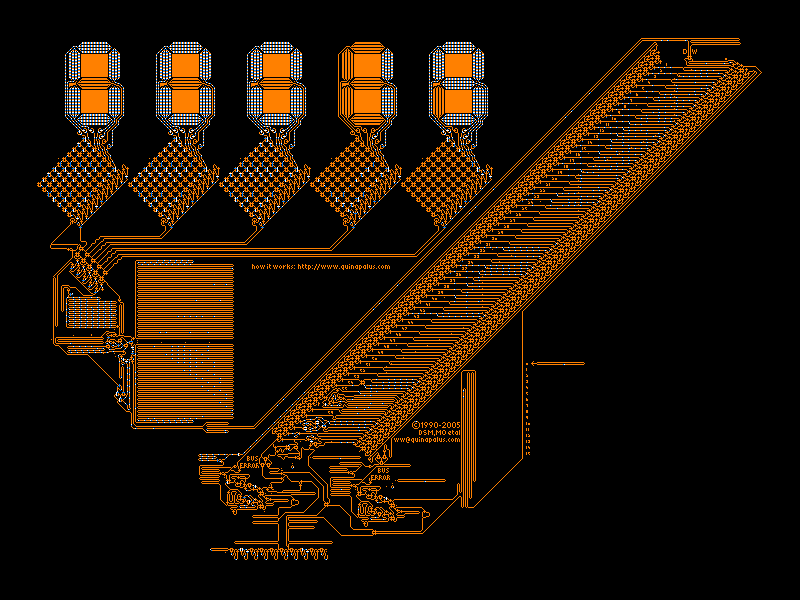

# Wireworld
Wireworld is a cellular automaton first proposed by Brian Silverman in 1987

### Opis: 

Komórka może znajdować się w jednym z czterech stanów:
1. Pusta,  
2. Głowa elektronu,  
3. Ogon elektrony,  
4. Przewodnik.  

Zwykle przymuje się następujące kolory stanów: biały, czerwony, żółty, czarny.

Kolejne generacje budowane są z wykorzystaniem zestawu pięciu zasad:
* Komórka pozostaje Pusta, jeśli była Pusta.
* Komórka staje się Ogonem elektronu, jeśli była Głową elektronu.
* Komórka staje się Przewodnikiem, jeśli była Ogonem elektronu.
* Komórka staje się Głową elektronu tylko wtedy, gdy dokładnie 1 lub 2 sąsiadujące komórki są Głowami Elektronu.
* Komórka staje się Przewodnikiem w każdym innym wypadku.

W WireWorld stosuje się sąsiedztwo Moore'a.
- sąsiedztwo Moore'a: 8 przylegających komórek (znajdujących się: na południu, na południowym-zachodzie, na zachodzie, na północnym-zachodzie, na północy, na północnym-wschodzie, na wschodzie i na południowym-wschodzie).
- sąsiedztwo von Neumanna: 4 przylegające komórki (na południu, zachodzie, północy i wschodzie).

Demonstracja:  
  

Wireworld wykorzystując język Java. Program w Javie powinien posiadać moduł wizualizujący "planszę" w czasie rzeczywistym (Swing + ewentualnie dowolna otwarta biblioteka).

Podstawowe funkcje programu:

- wczytywanie do programu początkowej konfiguracji z pliku w wybranym formacie,

- przeprowadzenie zadanej liczby generacji,

- wizualizacja on-line,

- zapisywanie bieżącej generacji do pliku (który może zostać potem wczytany).

rogram powinien posiadać klasy odpowiadające za bardziej zaawansowane struktury w Wireworld, np: bramka logiczna AND, bramka logincza OR, dioda, itp.

W formacie pliku przechowującego generację należy zawrzeć informacje o tym, czy jest to definicja pojedynczej komórki czy całego obiektu.

Przykład:
Diode: 0, 3, Normal
Diode: 0, 9, Reversed
ElectronHead: 1, 3
ElectronHead: 1, 9 
ElectronTail: 0, 3
ElectronTail: 0, 9 
  

## Przydatne linki: 

http://en.wikipedia.org/wiki/Wireworld  
http://mathworld.wolfram.com/WireWorld.html  
http://www.quinapalus.com/wi-index.html -- komputer znajdujący liczby pierwsze zaimplementowany w Wireworld:  
  

